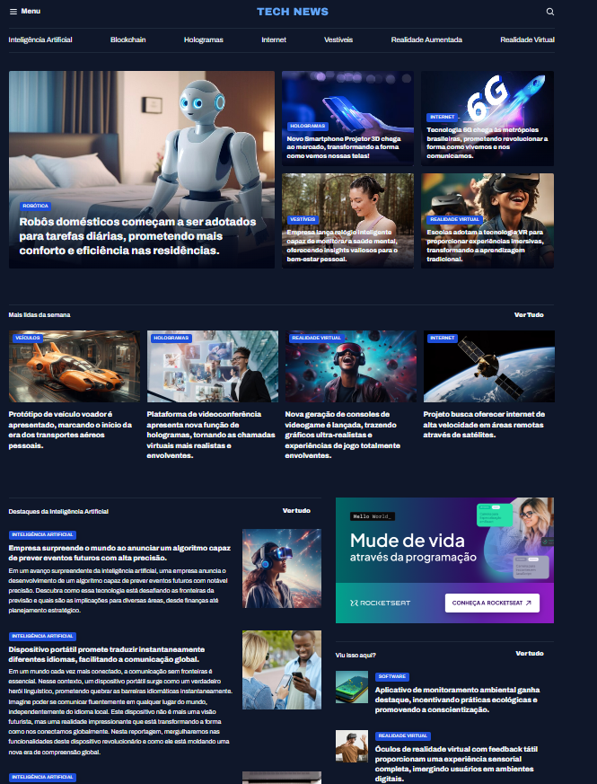

# Portal de Notícias

Projeto de uma página web para um portal de notícias, desenvolvido com foco na construção de layouts modernos, organização visual de conteúdos e estilização utilizando CSS.

## 📌 Sobre o projeto

O **Portal de Notícias** apresenta uma interface inspirada em sites de notícias, com seções organizadas para exibição de manchetes, categorias, artigos em destaque e conteúdos informativos.

O projeto foi criado para praticar conceitos fundamentais de desenvolvimento front-end, incluindo estruturação semântica, organização de elementos e estilização de páginas web.

## 🖥️ Prévia do projeto




## 🚀 Tecnologias utilizadas

- **HTML5** — estrutura e semântica da página;
- **CSS3** — estilização, cores, tipografia e organização do layout.

## ✨ Funcionalidades

- Layout de portal de notícias;
- Organização visual de conteúdos e manchetes;
- Seções para notícias em destaque;
- Estrutura semântica com HTML;
- Estilização personalizada com CSS.

## 📂 Estrutura do projeto

```bash
Portal_noticia/
├── assets/
├── index.html
├── style.css
└── README.md